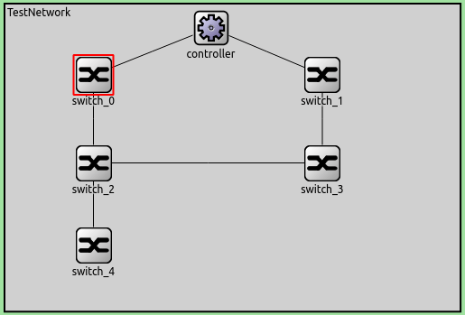

## Flexible Time-Triggered With Software Defined Network

This project trys to simulate FTT with SDN

### Installation
- This project requires OMNeT++ 5.4.1 to run
- Clone or download this repo
- Open project with this repo name, than browse this folder
- You can run the simulation

	
